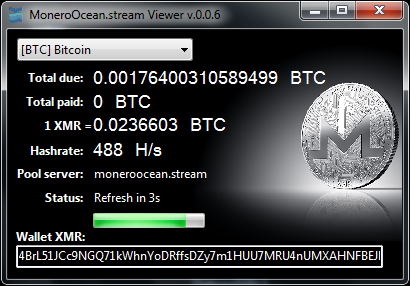

# MoneroOcean.stream Viewer (a viewer for pool miner)

### Download release:

https://github.com/ddeeproton/MoneroOceanStream/tree/master/releases

### Download sources:

https://github.com/ddeeproton/MoneroOceanStream/tree/master/sources

# Description: 

A viewer that shows information from moneroocean.stream pool miner server and convert values in other currencies. 

Currencies supported:

[USD] $

[EURO] €

[CAD] Canadian Dollar

[CHF] Swiss Franc

[CNY] Renminbi Yuan

[GBP] British Pound Sterling

[JPY] Japanese Yen

[KRW] Korean Won

[BTC] Bitcoin 

[ETH] Ethereum

[LTC] Litecoin

# How to use?

1. Start your miner on moneroocean.stream server

2. Fill the XMR adress on application "MoneroOcean.stream Viewer"

# How to Build? 

Download Lazarus for Windows, open and build "moneroocean_stream_manager.lpi". 

http://www.lazarus-ide.org/index.php?page=downloads

# Changes

### v0.0.1 
	First commit

### v0.0.2
	Fix issue memory management
	
### v0.0.3
	Add [BTC] Bitcoin 
	
	Add [ETH] Ethereum
	
### v0.0.4
	Add [KRW] Korean Won
	
	Add [LTC] Litecoin

